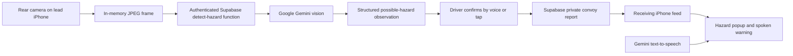

# Pudle — your road companion

> Built for a GitHub Copilot contest using GitHub Education’s Copilot access. This repository documents the MVP developed for the submission.

Pudle is an iPhone prototype that turns a possible road hazard seen by one phone into a driver-confirmed report for a private convoy. Google Gemini interprets camera frames and generates natural voice audio; the driver decides whether to share the observation. Another phone receives a visible alert and can speak the report aloud.

[Live demo landing page](https://pudle-demo.vercel.app) · [Watch the demo](https://www.youtube.com/shorts/8gv9OXGDTJA) · [Web convoy app](https://pudle-demo.vercel.app/app) · [Native iPhone setup](apps/mobile/ios/README.md)

## Recorded demo

The video demonstrates three scenarios: a fallen tree, an animal beside the road, and a pothole. Hazard photos are displayed on a computer and viewed through the iPhone camera. The lead phone asks for confirmation, the driver says **“report it”** or taps to confirm, and the receiving phone displays the report. Long response waits are shortened in the edited video.

**Demo mode is enabled by default in this MVP.** It uses real authenticated backend delivery while bypassing receiver GPS and direction filtering. It does not establish on-road accuracy, measured object distance, or reliable background delivery. No simulated coordinates are inserted into reports. Camera confirmations without usable GPS are sent as unlocated convoy-member reports in demo mode. Disable Demo mode to use the normal location relevance checks.

## Implementation



### Camera and Gemini vision

The native SwiftUI app uses AVFoundation to capture rear-camera frames while Pudle is on screen. It keeps the newest frame in memory, rotates it for the phone orientation, resizes it to about 640 pixels wide and compresses it as JPEG. It does not record a video or save camera images to disk.

The app sends a frame to the authenticated `detect-hazard` Supabase Edge Function. The function verifies the user session and calls Google's Gemini Interactions API using a server-side `GEMINI_API_KEY`. The default vision model in this implementation is **`gemini-3.5-flash-lite`**, configurable through `GEMINI_VISION_MODEL`.

Gemini returns structured JSON describing whether an outdoor roadway is visible, whether a possible hazard exists, its category, left/right/center side, possible road blockage, a short label, and model confidence. Categories include trees/branches, debris, stopped vehicles, animals, potholes and other objects. The server validates and clamps the result. Instructions require visible roadway context and discourage identities, plate recognition and invented distances. This reduces false positives but does not eliminate them; confidence is not measured accuracy.

Automatic checks run every 15 seconds by default. An optional faster setting checks every three seconds; Check now requests another frame. A detection filter requires either two agreeing observations or one high-confidence observation before automatic confirmation. The **What do you see?** action requests a short scene description from a fresh frame and can also initiate confirmation when that response flags a hazard.

### Voice interaction

**Talk to Pudle** opens a short push-to-talk session using Apple's Speech framework, with on-device recognition when supported. Implemented commands are scene description, **report it**, and **cancel**. There is no always-listening wake word, general conversational agent or live weather lookup yet.

A pending camera observation is spoken before the app listens for confirmation. Nothing is automatically reported solely because Gemini flagged an object. Confirmation sends the hazard type, side, possible-blockage flag and available capture-time GPS position to the selected convoy.

The `speak` Edge Function generates WAV audio with **`gemini-3.8-flash-lite-tts`**, configurable through `GEMINI_TTS_MODEL`. Four personalities select voice/style combinations: calm co-pilot, buddy, professional and energetic. Natural Gemini voice defaults on. Timeouts or unavailable cloud audio fall back to an installed iPhone voice. API quotas and model availability can affect latency.

### GPS, reports and receiving-phone alerts

Core Location runs between Start drive and Stop drive. GPS remains local except for positions attached to explicitly confirmed reports and a road corridor the user explicitly records. Camera reports in normal mode use a fix matched within three seconds of frame capture and horizontal accuracy of at most 40 meters. The UI distinguishes tracking being active from GPS being ready.

Normal-mode receiver checks use the phone's location, movement, direction and optional recorded road corridor to decide whether a report is relevant and ahead. A camera report with unverified receiver direction waits for a reliable match. Duplicate, stale, own and irrelevant reports are filtered. Warnings do not infer precise object depth from a single camera image.

The native app polls the authenticated convoy feed approximately every two seconds while foreground and also checks from background location callbacks. A relevant report presents a hazard sheet with a **Got it** button and spoken warning. While another app is foreground, local notifications provide the banner path when permissions and execution allow it. There is no remote push-notification service. A successful send means the backend accepted the report; it is not a receiver acknowledgment.

Demo mode presents new reports from the other convoy member without waiting for the normal GPS/direction match, while avoiding repeated popups. Both phones must have an active drive and belong to the same convoy.

### Google Maps

A possible blockage can offer a reviewed detour. With a saved destination and detour waypoint, Pudle opens Google Maps to plan that route. Pudle cannot silently change an already-running Google Maps route. Camera capture requires Pudle in the foreground; background camera capture is not supported on iPhone.

## Start here

- **Review the demo:** [landing page](https://pudle-demo.vercel.app) and [recording](https://www.youtube.com/shorts/8gv9OXGDTJA).
- **Review the iPhone product:** [native app and setup](apps/mobile/ios/README.md).
- **Review the website:** [Vercel web app](deploy/vercel/README.md).
- **Review the backend:** [Supabase overview](supabase/README.md).
- **Browse supporting work:** [documentation](docs/README.md), [research](research/README.md), and [earlier browser prototype](prototypes/browser/README.md).

## Project structure

```text
pudle/
├── apps/mobile/ios/      # Current native iPhone app + Swift core tests
├── apps/mobile/expo-go/  # Earlier Expo demo
├── deploy/vercel/        # Live landing page + web convoy app
├── supabase/             # Shared backend, Edge Functions + migrations
├── docs/                 # Guides and implementation notes
├── research/             # Experiments, evaluation plans + roadmap
├── prototypes/browser/   # Earlier browser application, kept separate
├── .github/              # Automation + Copilot configuration
└── README.md             # Product and implementation overview
```

| Directory | Purpose |
|---|---|
| `apps/mobile/ios/Pudle/` | Native SwiftUI app, camera, GPS, speech, accounts and convoy delivery |
| `apps/mobile/ios/PudleCore/` | Pure Swift alert policy, road relevance, phrases and tests |
| `supabase/functions/` | Authenticated Gemini vision, natural speech and shared helpers |
| `supabase/migrations/` | Convoys, consent, hazard events, access policies and optional cleanup |
| `deploy/vercel/` | Next.js demo landing with screenshots/video and a separate web convoy app |
| `apps/mobile/expo-go/` | Earlier foreground Expo demo |
| `prototypes/browser/` | Earlier browser/Sites application, its tests, scripts and configs |
| `research/` | Local-model research and benchmarks |

The web app and earlier research prototype are separate from the native iPhone camera implementation. See their own setup notes before using them.

## Run the iPhone app

Requires macOS, Xcode 26+, an iPhone with iOS 17+, and XcodeGen.

```bash
cd apps/mobile/ios
cp Config/Local.example.xcconfig Config/Local.xcconfig
# Fill in Apple signing and Supabase URL + public/publishable key.
xcodegen generate
open Pudle.xcodeproj
```

Select your connected iPhone and run the app. A Personal Team development install requires device trust and Developer Mode; paid Apple Developer membership is needed for TestFlight distribution. On two phones, sign in with different accounts, create/join the same convoy, and start a drive on each. See [the native setup guide](apps/mobile/ios/README.md) for detailed configuration and limitations.

## Configure the backend

Apply the convoy and hazard-event migrations to your Supabase project. Deploy `detect-hazard` and `speak`, and add **`GEMINI_API_KEY`** as an Edge Function secret. Optional model overrides are `GEMINI_VISION_MODEL` and `GEMINI_TTS_MODEL`. Never put the Gemini key in the app, browser bundle or repository.

```bash
supabase functions deploy detect-hazard --project-ref YOUR_PROJECT_REF
supabase functions deploy speak --project-ref YOUR_PROJECT_REF
```

Auth and Row Level Security restrict reports to authorized convoy members. Native report requests use client event IDs for idempotency. Report expiry hides stale hazards; immediate physical deletion is not guaranteed. A separate retention cleanup migration and schedule are provided. Camera frames are forwarded to Google for processing; they are not stored by this app or Edge Function, and Google's own service policies still apply. No license plate recognition is implemented.

## Run the website

Use Node.js 22.13+ and configure the values from `deploy/vercel/.env.example` in an ignored local environment file.

```bash
cd deploy/vercel
npm ci
npm run build
npm run dev
```

## Verification and next steps

The Swift core suite passed **55 tests**, covering alert policy, relevance, event decoding and voice commands. Device builds compiled and installed on an iPhone XR and an iPhone 17 Pro Max. Backend checks covered authenticated vision/voice requests, private convoy access, report creation and duplicate prevention. The owner recorded the photo-based two-phone demo linked above.

```bash
swift test --package-path apps/mobile/ios/PudleCore
```

Further work includes measured road-scene accuracy and latency, receiver acknowledgments, robust background delivery, general conversation/weather, and external side-camera integration. This MVP is a prototype rather than a validated driving safety system.
